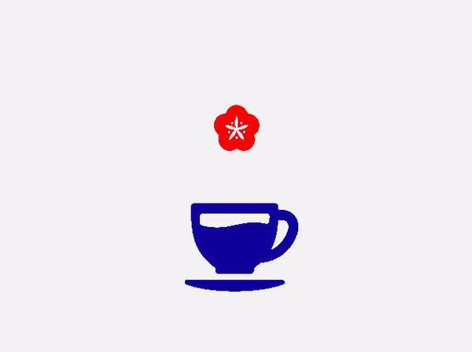

<h2 align=center>Lecture 09</h2>

<h1 align=center>Exercise: <em>Collision Detection</em></h1>

<h3 align=center>1 Messidor, Year CCXXXI</h3>

### Instructions

If you run the [**following `main.cpp`**](SDLProject/main.cpp) file, you will see the following animated sprites (which you can download [**here**](SDLProject/sprites/flower.png) and [**here**](SDLProject/sprites/cup.png)):


<sub>**Figure 1**: Starting behaviour.</sub>

Our goal is to add a gameplay mechanic to our scene whereby **the flower will shrink into non-existence _if_ it touches the cup**. The exact point of collision doesn't really matter for this exercise, as long you see something like this happening:



<sub>**Figure 2**: Desired behaviour.</sub>

We will achieve this through the following three steps:

#### STEP 1: _Set up the necessary data structures_

Similar to the data structures we needed to efficiently translate in our [**exercise last week**](https://github.com/sebastianromerocruz/CS3113-material/tree/main/exercises/player_input#step-1-set-up-the-necessary-data-structures), create the parallel data structures needed for our _scaling_. The speed at which the flower shrinks is totally up to you.

In the space provided for part 1 (lines 78 - 80):

```c++
// ———————————————— PART 1 ———————————————— //

// ———————————————— PART 1 ———————————————— //
```

Create the above data structures to set us up for the next step.

#### STEP 2: _"Alert" The Program Of A Collision_

Just like we did [**last class**](https://github.com/sebastianromerocruz/CS3113-material/tree/main/lectures/collision-detection#part-3-example), write code to detect a collision between the flower and the cup and **adapt it so that the flower will know that it has to shrink later in `update`**. Note that there should be _no_ scaling in this part. We are simply "flagging" the fact that a collision between the two objects has occurred.

Write your code in the space provided for part 2:

```cpp
    // ———————————————— PART 2 ———————————————— //
    
    // ———————————————— PART 2 ———————————————— //
```

_Hint_: This is a process very similar to how we record [**user input for translations**](https://github.com/sebastianromerocruz/CS3113-material/tree/main/lectures/player-input#part-5-keeping-track-of-the-players-motion) except, of course, it is not user input that triggers the shrinking in this case. 

#### STEP 3: _Apply the necessary transformations_

Finally, in the designated space for part 3, write code that will adjust the scale of our object every frame. If the objects haven't touched, the model matrix will be the same after `update`. If we have collided, then your code must reflect that by shrinking the object. Note that the object must remain "disappeared" after it has shrunk to scale `0.0f`, and not reset back to its original scale.

As always, make sure to adjuct for different frame rates, and watch out for negative numbers as well!

```c++
    // ———————————————— PART 3 ———————————————— //
    
    // ———————————————— PART 3 ———————————————— //
```

You can find the solutions [**here**](SDLProject/solutions/solution.cpp), though you should of course give it a shot before you look at it!