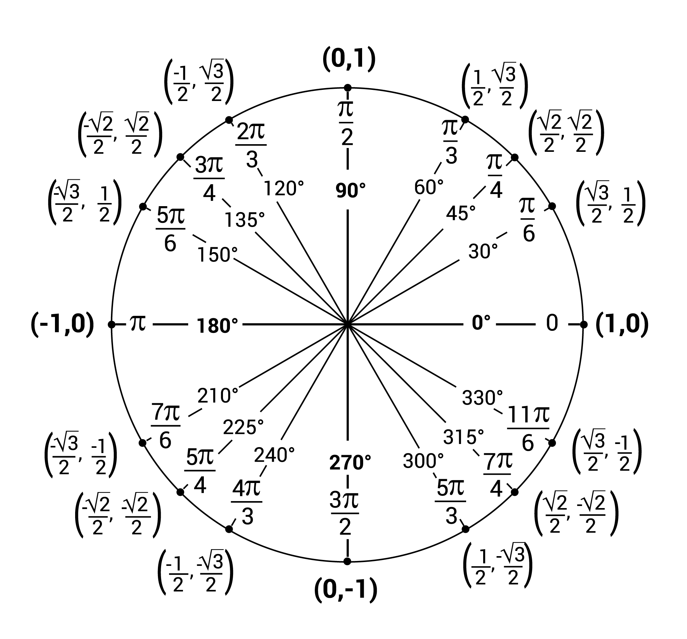
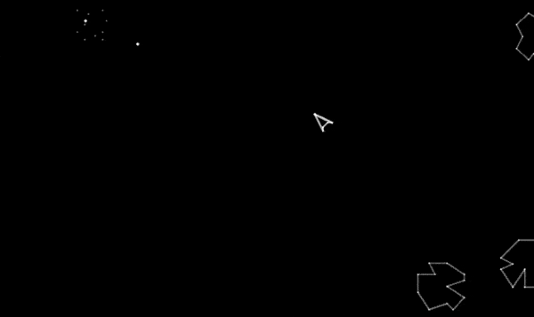
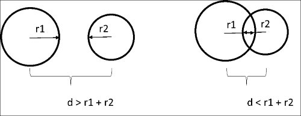
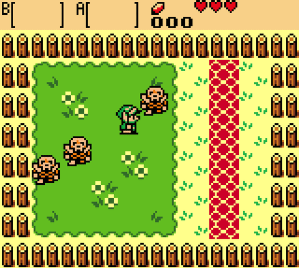
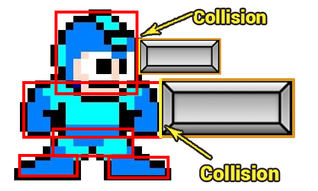
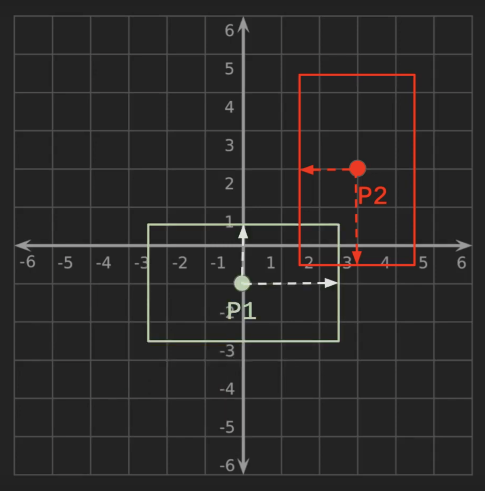
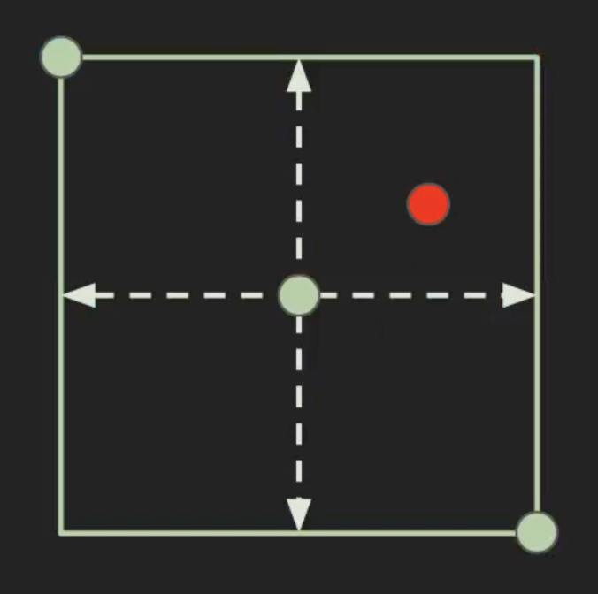

## Lecture 08

# [**Collision Detection**](SDLProject/main.cpp)

### 28 Prairial, Year CCXXX

***Song of the day***: _[**ミラクルすぎてヤバイ**](https://youtu.be/puaOtCox2CI) by Hige Driver feat. Shully (2014)._

### Sections

1. [**The Unit Circle**](#part-1-the-unit-circle)
2. [**Collision detection theory**](#part-2-collision-detection-theory)
    1. [**Circle-to-circle collisions**](#circle-to-circle-collisions)
    2. [**Point-to-circle collisions**](#point-to-circle-collisions)
    3. [**Box-to-box collisions**](#box-to-box-collisions)
    4. [**Point-to-box collisions**](#point-to-box-collisions)

### Part 1: _The unit circle_

We mentioned at the end of yesterday's class that we need to normalise our `player_movement` vector to avoid having our spites move twice as fast when moving diagonally. We do this with the `glm::normalize()` function:

```c++
if (glm::length(player_movement) > 1.0f)
{
    player_movement = glm::normalize(player_movement);
}
```

<sub>**Code Block 1**: The length of a vector, more commonly called its [**magnitude**](https://www.cuemath.com/magnitude-of-a-vector-formula/), is calculated by taking the square-root of the sum of its squared components. The magnitude of the `player_movement` vector is greater than 1.0 when the sprite is moving in more than one cartesian axis.</sub>

What [**normalisation**](https://www.freetext.org/Introduction_to_Linear_Algebra/Basic_Vector_Operations/Normalization/) does is turn a vector with a length greater than 1.0 to its **unit circle** equivalent. The purpose here is to scale back the vector to our desired 1.0 limit _without changing its direction_:



<sub>**Figure 1**: The unit circle. [***Source***](https://www.mometrix.com/academy/)</sub>

This actually has greater implications when it comes to handling player input. A joystick's input, after all, is inherently circular, while keystrokes (e.g. `WASD`) make squares. Pressing `D` to move left gives us a movement vector of `[1, 0]` (a magnitude 1.0 vector), while pressing both `D` and `W` to move diagonally yields `[1, 1]`—a magnitude 1.414 vector. This, in effect, means that by moving diagonally, we are moving about 40% faster than if we only move in one direction.

That's the real reason why code block 1 is necessary. Nothing particularly complicated, but certainly good to know, as it will affect your players' experience.

### Part 2: _Collision Detection Theory_

Really kind of the last thing required for us to make something worth of the "video game" title is some sort of physics simulation. The easiest of these is **collision detection**, so it is no surprise that it was one of the first (if not _the_ first) to get implemented into a game:


<sub>**Figure 2**: Collision detection is, quite literally, the entire _raison d'être_ of Atari's [**Pong**](https://en.wikipedia.org/wiki/Pong).</sub>

Nowadays, there are several ways of detecting collisions—all of them available to you—so let's take a look at them.

#### **Circle-to-circle collisions**

The easiest to calculate is _circle to circle collision detection_. Games like [***Hundreds***](https://en.wikipedia.org/wiki/Hundreds_(video_game)) and [***agar.io***](https://agar.io/) almost entirely rely on collisions of this kind, and both are massively popular. One of them was even designed by an [**NYU professor**](http://www.nealen.net/):


<sub>**Figure 3**: [**Hemisphere Games'**](http://www.osmos-game.com/) [***Osmos***](https://en.wikipedia.org/wiki/Osmos).</sub>


My favourite, though, would have to be the absolute arcade classic, Atari's [**Asteroids**](https://en.wikipedia.org/wiki/Asteroids_(video_game)):



<sub>**Figure 4**: Circle-to-circle detection at its finest.</sub>

---

Really, the only thing involved in circle-to-circle detection is a simple distance calculation from their centres. If we are in a cartesian plane, we can easily calculate this distance using the Pythagorean theorem:



<sub>**Figure 5**: The mathematics of circle-to-circle collision detection. Doesn't get more simple than this. [**Source**](https://www.oreilly.com/library/view/opengl-game-development/9781783288199/ch05s03.html)</sub>

In other words, _if the distance from the centres of the circles is less than the sum of their respective radii, we have a **collision**_.

#### **Point-to-circle collisions**

There's plenty of uses for point-to-circle collision detection:

- Clicking on a UI element with a mouse pointer.
- Move the player by selecting a target destination.
- Select a target to approach / attack.

Arguably easier than circle-to-circle, the math of point-to-circle is calculated by measuring the distance between the point to the centre of the circle. If the _point's distance is, at any point, smaller than the length of the radius, we have a collision_. We can calculate this using the distance formula:


<sub>**Figure 6**: The distance between two points in cartesian space. [**Source**](https://en.wikipedia.org/wiki/Euclidean_distance#Two_dimensions)</sub>

#### **Box-to-box collisions**

While the previous two collisions are easy to calculate, they are not the ones that we will likely be using the most. That honour goes to box-to-box collisions.



<sub>**Figure 7**: Collisions in Link's Awakening (a.k.a. the best handheld Zelda game and you can fight me on that if you want). [**Source**](https://gfycat.com/directleadingcoypu)</sub>

If you're not convinced, check out the following diagram:



<sub>**Figure 7**: Picturing Megaman in terms of boxes. [**Source**](http://www.kilobolt.com/collision-detection-basics)</sub>

The mathematics for this is interesting. We need to keep track of the box's centre (the same way we would with a circle). Let's call them _C1_ and _C2_:

1. Calculate the absolute difference (X<sub>diff</sub>) C1<sub>_x_</sub> and C2<sub>_x_</sub>.
2. Do the same for C1<sub>_y_</sub> and C2<sub>_y_</sub> (Y<sub>diff</sub>).
3. Calculate the distance between C1<sub>_x_</sub> and C2<sub>_x_</sub>. The formula for this is X<sub>distance</sub> = X<sub>diff</sub> - (width<sub>1</sub> + width<sub>2</sub>) / 2.
3. Calculate the distance between C1<sub>_y_</sub> and C2<sub>_y_</sub>. The formula for this is Y<sub>distance</sub> = Y<sub>diff</sub> - (height<sub>1</sub> + height<sub>2</sub>) / 2.
4. If both X<sub>distance</sub> and Y<sub>distance</sub> are below 0.0, you have a collision.



<sub>**Figure 8**: Visualisation of box-to-box collisions.</sub>

In code, this might look at follows:

```c++
float x_distance = fabs(x_coord_a - x_coord_b) - ((width_a + width_b) / 2.0f);
float y_distance = fabs(y_coord_a - y_coord_b) - ((height_a + height_b) / 2.0f);

if (x_distance < 0 && y_distance)
{
    // Collision!
}
```

<sub>**Code Block 2**: Box-to-box collision code. Please watch you parentheses carefully when doing this.</sub>

#### **Point-to-box collisions**

One last collision type that is relatively common is point-to-box; UI buttons in many games are square—shaped, for example. This one is pretty easy: simply _get the coordinates of the **top left** and **bottom right** corners, and check the points' coordinates fall inside of them_.



<sub>**Code Block 3**: Visualisation for box-point collisions.</sub>
