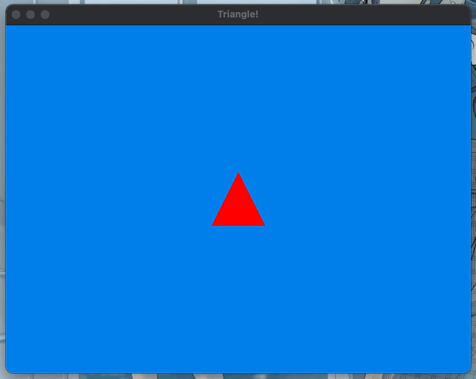
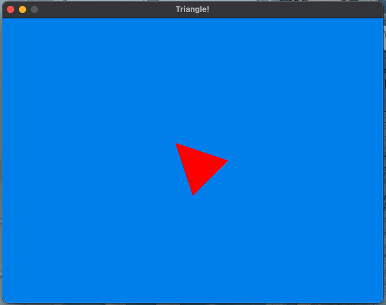
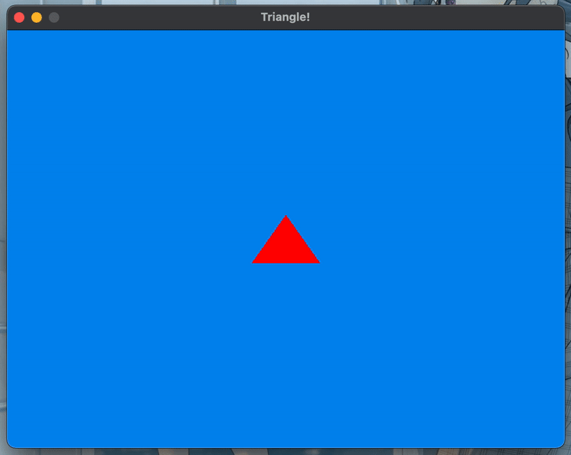
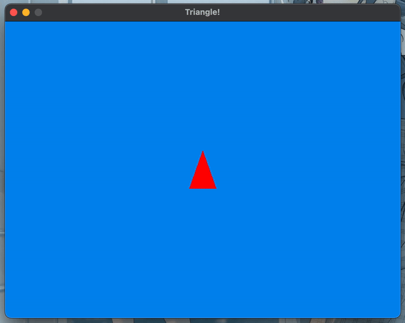

<h2 align=center>Lecture 04</h2>

<h1 align=center>Transformations</h1>

<h3 align=center>15 Horsebow Moon, Imperial Year 1180</h3>

<p align=center><strong><em>Song of the day</strong>: <a href="https://youtu.be/t8JyN05G68I?si=mF-9jEIYETEhLn1A"><strong><u>Dreamin' Keihin-Touhoku Line 7"</u></strong></a> by Beef [feat. Marina] (2015)</em></p>

### Sections

1. [**A little help**](#part-1-a-little-help)
2. [**Funny heartbeat or, how to scale a model matrix**](#part-2-funny-heartbeat-or-how-to-scale-a-model-matrix)
3. [**Rotating a model matrix**](#part-3-rotating-a-model-matrix)
4. [**Translating a model matrix**](#part-4-translating-a-model-matrix)

### Part 1: _A little help_

Our `main.cpp` file is pretty much destined to get bloated with code _real_ fast. The lines necessary to draw a simple triangle are already what might be considered a lot, so it might bear remembering that you can define functions and classes that are not immediately relevant to your game in separate helper files. For instance, I wrote a simple function that prints the contents of a matrix nicely:

```c++
const char MAT_SEP = '\t';

void print_matrix(glm::mat4 &matrix, int size)
{
    for (auto row = 0 ; row < size ; row++)
    {
        for (auto col = 0 ; col < size ; col++)
        {
            std::cout << matrix[row][col] << MAT_SEP;
        }
        
        std::cout << "\n";
    }
}
```

That's a bit of a bulky function. I've created a separate file, [**helper.cpp**](SDLProject/helper.cpp) and threw it in there. In order for `main.cpp` to use it, we simply need to add a declaration somewhere _before_ using it:

```c++
void print_matrix(glm::mat4 &matrix, int size);
```

<sub>**Code Block 1**: Note that this line exists in [**main.cpp**](SDLProject/main.cpp).</sub>

### Part 2: _Funny heartbeat or, how to scale a model matrix_

Suppose that we wanted to create a sort of heartbeat effect with our triangle, as such:



<sub>**Figure 1**: Our triangle beating like a heart.</sub>

Using what we know about the `glm::scale()` method and the `update()` function, try to replicate this behaviour yourself. You may have to define your own global constants and variables.

If we were to print the contents of our model matrix (`model_matrix`), we would see something like this:

```
1	0	0	0	
0	1	0	0	
0	0	1	0	
0	0	0	1
```

<sub>**Figure 2**: The contents of `model_matrix` upon initialisation.</sub>

Once we made our changes to make our triangle scale infinitely by a factor 1% per frame, these values will, of course, change. If we were to print the contents of `model_matrix` in this case, we would see the following:

```
Current Frame: 0
1	0	0	0	
0	1	0	0	
0	0	1	0	
0	0	0	1	

Current Frame: 1
1.01	0	0	0	
0	1.01	0	0	
0	0	1	0	
0	0	0	1	

Current Frame: 2
1.0201	0	0	0	
0	1.0201	0	0	
0	0	1	0	
0	0	0	1	

Current Frame: 3
1.0303	0	0	0	
0	1.0303	0	0	
0	0	1	0	
0	0	0	1	

Current Frame: 4
1.0406	0	0	0	
0	1.0406	0	0	
0	0	1	0	
0	0	0	1	

Current Frame: 5
1.05101	0	0	0	
0	1.05101	0	0	
0	0	1	0	
0	0	0	1	
```

<sub>**Figure 3**: The contents of `model_matrix` for the first 5 frames.</sub>

Although the precision may not be ideal (such is the nature of computers), it does indeed look like our code is adding 1% of 1 to the first two values of the identity matrix. This makes sense; we are working with a model with only two directions, for the z-coordinate should not change. Recall, too, that the fourth 1 in the matrix represents our use of homogeneous coordinates (see lecture 3 if you need a refresher on that).

---

So how do we accomplish a "heartbeat" effect? In other words, how do we get our model to "expand" to a certain point, and then "contract" to, say, its original size?

There are various ways to do this. Here's how to do this in a way that does not necessitate us having to know the contents of our matrix.

```c++

/* Some code... */

const float GROWTH_FACTOR = 1.01f;  // growth rate of 1.0% per frame
const float SHRINK_FACTOR = 0.99f;  // growth rate of -1.0% per frame
const int MAX_FRAME = 40;           // this value is, of course, up to you

int g_frame_counter = 0;
bool g_is_growing = true;

void update()
{
    // STEP 1
    glm::vec3 scale_vector;
    g_frame_counter += 1;
    
    // STEP 2
    if (g_frame_counter >= MAX_FRAME)
    {
        g_is_growing = !g_is_growing;
        g_frame_counter = 0;
    }
    
    // STEP 4
    scale_vector = glm::vec3(g_is_growing ? GROWTH_FACTOR : SHRINK_FACTOR,
                             g_is_growing ? GROWTH_FACTOR : SHRINK_FACTOR,
                             1.0f);
    
    // STEP 4
    g_model_matrix = glm::scale(g_model_matrix, scale_vector);
}

/* More code... */
```

<sub>**Code Block 2**: How to achieve a simple "beating" effect.</sub>

Let's go through the steps one-by-one:

1. Regardless of whichever direction we are going to scale, we will need our scale vector, `scale_vector`. Thankfully, declaring a variable without instantiating is perfectly normal C++. In this method, we are keeping track of what is happening by using a "frame count". Since a call to `update()` means that we are in a new frame, we increase its value as well.
2. Before we get to scaling, we need to see if we are still within the "bounds" of the current direction we are scaling in. This is where the `frame_count` comes in handy. By defining a constant `MAX_FRAME` in the global scope and setting it `40`, I intend on letting my model to scale in either direction for about 40 frames. Once it reaches that threshold, I will reset the frame counter and tell the rest of the code that we are no longer going in the same direction (`is_growing = !is_growing;`).
3. So now that we've taken care of determining which direction we are scaling in, we can create the appropriate scale vector to achieve this. We have two choices here: use `GROWTH_FACTOR` or use `SHRINK_FACTOR`. We can accomplish this in a simple one-liner using the [**ternary operator**](https://www.programiz.com/cpp-programming/ternary-operator), as shown above, or we can use an `if`- statement. That is completely up to you.
4. What is left is to simply use `glm::scale()` to update our model matrix.

The result is a very nice and fluid "heartbeat" effect for our triangle.

### Part 3: _Rotating a model matrix_

The only real difference between scaling and rotation is the function that we'll be using. As you may have guessed, we use `glm::rotate()` instead.

Let's say that your game started with out pulsating triangle not looking up, but at a 45-degree angle to the normal. We can easily accomplish this by throwing the following lines onto our `main.cpp` file:

```c++
/* Some code... */

const float INIT_TRIANGLE_ANGLE = glm::radians(45.0);

/* Some more code... */

void initialise()
{
    /* Some more code... */
    g_model_matrix = glm::mat4(1.0f);
    g_model_matrix = glm::rotate(g_model_matrix, TRIANGLE_INIT_ANGLE, glm::vec3(0.0f, 0.0f, 1.0f));
}
```

<sub>**Code Block 3**: Rotating our triangle's model matrix by 45-degrees. Note that OpenGL works in _radians_, so you must convert your angles from degrees to radians where necessary. For consistency, I have chosen to do so with OpenGL's built-in `glm::radians()` function.</sub>

The result is an exciting, slightly rotated version of what we had before:



<sub>**Figure 4**: Our beating triangle rotated 45-degrees to the _left_.</sub>

You may be wondering why `glm::rotate()`'s third parameter is a `glm::vec3` object. While it is not the only way to invoke `glm::rotate()`, doing so this way will assign each the three values of the `glm::vec3` object to an x-, y-, and z-plane. What OpenGL is basically looking for here is the axis upon which you want to rotate your model. In our case, we will basically only be rotating on the z-axis. Technically, this `glm::vec3` object can have any value other than `1.0f`—it is essentially considering any non-zero value to mean that we want to rotate on that specified axis.

Since all of our games for the time being will be in two dimensions (i.e. the x- and y-dimensions), rotating on these two axes would only look to us, a viewer with a bird's eye view, like shrinking and stretching:

- Rotating on the **x-axis**:

```c++
g_model_matrix = glm::rotate(g_model_matrix, TRIANGLE_INIT_ANGLE, glm::vec3(1.0f, 0.0f, 0.0f));
```



<sub>**Figure 5**: An x-axis rotation gives the impression of a horizontal "compression".</sub>

- Rotating on the **y-axis**:

```c++
g_model_matrix = glm::rotate(g_model_matrix, TRIANGLE_INIT_ANGLE, glm::vec3(0.0f, 1.0f, 0.0f));
```



<sub>**Figure 6**: A y-axis rotation gives the impression of a vertical "compression".</sub>

---

Cool, so now that we've seen how to apply simple rotations onto our models, let's animate a bit. I'm gonna delete my initial rotation so that my triangle can start upright again, and add the following to our code:

```c++
/* Some code... */

const float ROT_ANGLE = glm::radians(1.5f); // Let's try a smaller angle

/* More code... */

void update() 
{
    glm::vec3 scale_vector;
    g_frame_counter += 1;

    // Every frame, rotate my model by an angle of ROT_ANGLE on the z-axis
    g_model_matrix = glm::rotate(g_model_matrix, ROT_ANGLE, glm::vec3(0.0f, 0.0f, 1.0f));
    
    if (g_frame_counter >= MAX_FRAME)
    {
        g_is_growing = !g_is_growing;
        g_frame_counter = 0;
    }
    
    scale_vector = glm::vec3(g_is_growing ? GROWTH_FACTOR : SHRINK_FACTOR,
                             g_is_growing ? GROWTH_FACTOR : SHRINK_FACTOR,
                             1.0f);
    
    g_model_matrix = glm::scale(g_model_matrix, scale_vector);
}
```


<sub>**Code Block 4** and **Figure 7**: A simple spinning animation (i.e. 1.5-degree anti-clockwise rotation per frame).</sub>

### Part 4: _Translating a model matrix_

Translating a model matrix is even more simple—we simply use the `glm::translate()` function. This function accepts our original 4 x 4 matrix as its first parameter, and a `glm::vec3` object (again representing the translation values in the x-, y-, and z-coordinates) as its second. It, too, returns another `glm::mat4` object:

```c++
g_model_matrix = glm::translate(g_model_matrix, glm::vec3(1.0f, 0.0f, 0.0f));
```

<sub>**Code Block 5**: Reassigning the model matrix a version of itself translated 1 "units" to the right.</sub>

Let's apply this to our `update()` function and see what we get:

```c++
/* Some code here... */

float TRAN_VALUE = 0.025f;

/* More code here... */

void update() 
{
    // Initialise our scale_vector and update the number of frames past
    glm::vec3 scale_vector;
    g_frame_counter += 1;
    
    // Once we reach our limit, we switch directions
    if (g_frame_counter >= MAX_FRAME)
    {
        g_is_growing = !g_is_growing;
        g_frame_counter = 0;
    }
    
    // Decide if the matrix will be scaled up or scaled down
    scale_vector = glm::vec3(g_is_growing ? GROWTH_FACTOR : SHRINK_FACTOR,
                             g_is_growing ? GROWTH_FACTOR : SHRINK_FACTOR,
                             1.0f);
    
    // Our transformations
    g_model_matrix = glm::translate(g_model_matrix, glm::vec3(TRAN_VALUE, 0.0f, 0.0f));
    g_model_matrix = glm::scale(g_model_matrix, scale_vector);
    g_model_matrix = glm::rotate(g_model_matrix, ROT_ANGLE, glm::vec3(0.0f, 0.0f, 1.0f));
}
```


<sub>**Figure 8**: Maybe not what you expected?</sub>

Yep. We'll talk about why _this_ is happening next week.
